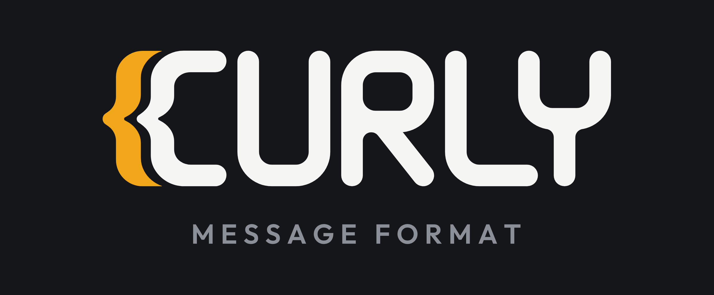
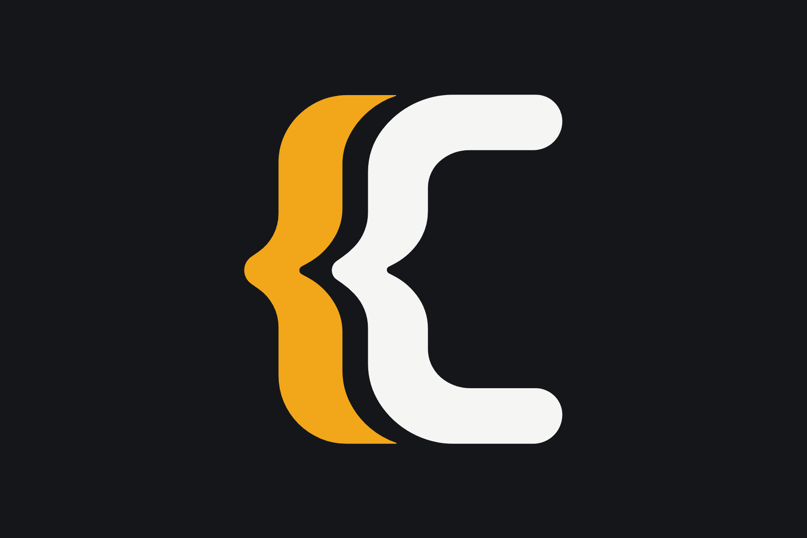

# Brand

The visual identity of the Curly Message Format.

| File | What it is |
| --- | --- |
| [`curly-icon.svg`](./curly-icon.svg) | The icon: a brace and a C. `viewBox="0 0 1024 1024"` |
| [`curly-wordmark.svg`](./curly-wordmark.svg) | The wordmark: the icon, the letters `URLY` and the line `MESSAGE FORMAT`. `viewBox="0 0 999 406"` |
| [`curly-wordmark-no-tagline.svg`](./curly-wordmark-no-tagline.svg) | The wordmark without that line, in its own tight box. `viewBox="0 0 999 297"` |
| [`usage-wordmark.png`](./usage-wordmark.png) | The first plate above: the wordmark in colour on the dark ground, 2800×1160. A picture of the marks, not an asset to place. |
| [`usage-icon.png`](./usage-icon.png) | The second: the icon alone in the same treatment, 1740×1160. |

Each of the three SVGs is one `<path>` on a transparent background with no
`fill`, no `width` and no `height`, so it renders black by default, takes any
`fill` for a light-on-dark variant, and scales to whatever box it is given.

## How the three marks relate

The wordmark is built from the icon, not drawn beside it. The `{C` at its head
**is** `curly-icon.svg`'s path, uniformly scaled so the icon's height becomes
the cap height (256 units) and translated into place. Everything after it is
drawn to four numbers the icon supplies:

| | Units | Where it comes from |
| --- | --- | --- |
| Stroke | 40.70 | the thickness of the icon's horizontal arms at the scale the `{C` is placed |
| Letter width | 174.93 | the icon's `C` is 172.39 wide; the letters take the widest of the traced boxes, the `R`'s |
| Corner radius | 64.98 outer, 24.28 inner | the largest of the icon's own outer curves, 44.63 on the centre line |
| Gap | 20.60 | the same at every joint: icon to `U`, `U` to `R`, `R` to `L` |

So `U`, `R`, `L` and `Y` are one width and one weight, every corner in all four
turns on one radius, and the three gaps are one gap. Free terminals are
semicircles of half the stroke, 20.35, which is how the icon's arms end too.
Where a stroke runs into the side of another — the `R`'s leg under its bar, the
`Y`'s stem under its fork — the junction is rounded by 15.69.

Two shapes carry their own decisions:

- the `R` has a connected top: the stem runs the whole cap height and the bowl
  springs off it and closes back onto it, so the letter has no free bar
  terminal. Its bar sits 133.76 below the cap line and the leg leaves that bar
  53.95 right of the stem, at 38.3° from vertical;
- the `Y` is a `U` fork on a stem, not a rotated brace. The fork is the letter
  width, its bar sits 128.55 below the cap line, and the stem rises 25.50 into
  that bar so the two read as one letter. The fork overlaps the `L`'s foot by
  37.27 — the mark's one kern, which is why `L` and `Y` have no gap between
  them.

The tagline is the one part of the wordmark that is not drawn from the icon's
numbers. It is set in capitals at 52.0 with 0.22 em of letter spacing, its cap
line 72 below the letters' baseline, and its ink centre on the wordmark's ink
centre rather than on the viewBox — the `{` at the head and the `Y` at the tail
weigh differently, so centring on the box would read as off-centre.

The icon survives a redraw of the letters unchanged: where it appears it keeps
the modulation it was drawn with, which is why its brace reads lighter than the
letters beside it. The letters are made of straight lines and circular arcs
only; the tagline carries the quadratics of its typeface, converted to
outlines.

## Using them

- Give the wordmark clear space of at least half the letter stroke, which is the
  padding already inside the viewBox.
- Below roughly 280 px wide the tagline stops being legible: use
  `curly-wordmark-no-tagline.svg`, which stays readable down to about 64 px.
- Colour by setting `fill` on the `<svg>` or the `<path>`, or with
  `color` and `fill="currentColor"` if you add that attribute yourself.

## Colour

The plates at the top are variant A of the dark treatment: the brace in the
theme colour, the `C` and the letters in the base, the tagline dimmed. The
icon is the same split with nothing after the `C`, which is the point of
drawing the wordmark from it.

The palette is settled, and it is two palettes. A ground carries its own theme
colour, because one value cannot serve both: the amber that sits at 8.8:1 on
the dark ground falls to 1.9:1 on the light one.

Dark:

| | | Contrast on the ground |
| --- | --- | --- |
| Ground | `#14161A` | |
| Base | `#F5F5F3` | 16.6:1 |
| Dimmed | `#8A8F98` | 5.6:1 |
| Theme | `#F2A61A` | 8.8:1 |

Light:

| | | Contrast on the ground |
| --- | --- | --- |
| Ground | `#F5F5F3` | |
| Base | `#14161A` | 16.6:1 |
| Dimmed | `#6B7079` | 4.6:1 |
| Theme | `#FF4365` | 3.1:1 |

Every pair but one clears the 4.5:1 that text is held to. The light theme
colour clears 3:1 instead, which is what WCAG 1.4.11 asks of a graphic: the
brace carries it, and so do a border, an icon and a rule. Text set in it — a
link, a label — does not, and takes the base or a darker tone of the hue.

Nothing in the SVGs depends on any of it: they carry no `fill` at all.

Two colours need two elements. Each SVG is a single `<path>` filled nonzero,
so `fill` cannot colour the brace apart from the rest; split it into one
`<path>` per colour, each carrying the subpaths of that colour together, in
their original order and still filled nonzero. In `curly-icon.svg` the first
subpath is the brace and the second the `C`. In `curly-wordmark.svg` those two
come first in the same order, then eleven for the letters and twenty-seven for
the tagline.

One `<path>` per subpath is not the same thing, and the tagline is where the
difference shows: the `O`'s counter is a subpath the nonzero rule cuts out of
the ring around it, and given an element of its own it fills the letter in.

## Licence

The marks are **not** covered by the repository's MIT licence. The name *Curly
Message Format*, the three SVGs and the two plates are © 2026
G.A.W.Group, s.r.o., all rights reserved, under the terms in
[`LICENSE`](./LICENSE) beside this file. This README is not one of them:
it is MIT like everything else in the repository.

The short of it: you may say your software implements the format, and you may
use these files unchanged to refer to it — scaled to any size, in any single
colour. You may not redraw them, fold them into a mark of your own, or use
them in a way that reads as official or endorsed. The format is open; its
marks are how people tell it apart from everything else.

## Provenance

The marks were traced from three generated bitmaps — the icon on a light
rounded tile, and two wordmark variants differing only in the `Y`. They are not
kept here. Nothing in these files still matches them: the letters were redrawn
afterwards to the icon's own numbers and the tagline was re-set in capitals, so
the bitmaps are the origin of the mark rather than a target it answers to.

The tagline is set in Outfit 600, converted to outlines. The face is published
under the SIL Open Font License 1.1; artwork made with a font is not itself a
font, so the outlines carry no licence obligation, but the attribution is
recorded here because the wordmark cannot be re-set without it.
